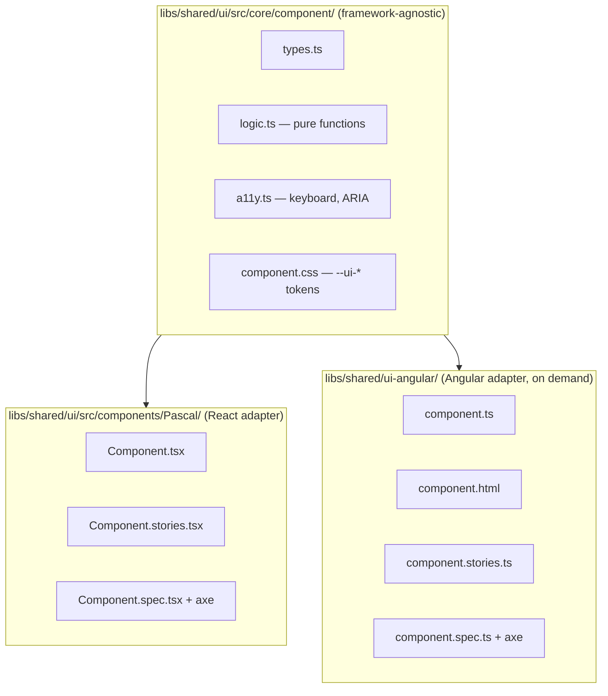

# Agent pipeline — full guide

A Jira → Figma → React/Angular component pipeline built on top of GitHub
Copilot Chat (Agent mode) and MCP servers. It supports two modes:

- **Single-ticket mode** — one Jira ticket with no parent epic. The
  pipeline runs end-to-end and writes a PR. No persistent memory.
- **Epic mode** — Jira ticket has a parent epic. The pipeline maintains
  durable per-epic memory under `.agent-run/epics/<EPIC_ID>/` so that
  sibling subtickets (worked on different days) share decisions, tokens,
  exports, design source, and ADRs.

Both modes are auto-detected from the Jira ticket — you don't pick.

---

## TL;DR — answers to the common questions

**Can I work on both epic-level and single tickets?**
Yes. Phase 0 of the orchestrator inspects the Jira ticket's `parent`.

- No parent epic → single-ticket mode (silent).
- Parent epic already marked ignored → single-ticket mode (silent).
- Parent epic already has memory (`epic.json`) → epic mode (silent;
  you opted in earlier).
- Parent epic is new → the orchestrator ASKS once whether to use shared
  memory for it.

**Do I have to use shared epic memory for every epic? My epic is
"performance improvements" — the subtickets are unrelated.**
No. Epic memory is **opt-in per epic**. When the orchestrator sees a
parent epic for the first time it asks:

> Ticket {SUB} is part of epic {EPIC} — "{title}". Use shared epic
> memory for this epic? Say YES only if the subtickets all build or
> extend the same component/feature. Say NO for grab-bag epics like
> performance/bugfix/infra sweeps. [y/N]

If you answer **no**, the orchestrator runs
`pnpm agent:epic ignore --epic {EPIC} --reason "..."`, which writes a
marker file. From then on every sibling subticket under that epic runs
in single-ticket mode silently — no prompts, no shared `must_respect`,
no cross-subticket constraints. You can reverse the decision any time
with `pnpm agent:epic unignore --epic {EPIC}`.

Rule of thumb:

- **YES (epic mode)** — "Build the data-table" with subtickets for
  table / pagination / sticky header. Shared exports, shared tokens.
- **NO (single-ticket)** — "Q3 performance sweep", "Backlog bugfixes",
  "Dependency upgrades". Unrelated tickets that happen to be siblings.

**When I work on an epic, do I have to re-attach Figma every subticket?**
Yes — and this is intentional. Each subticket usually shows a different
state of the same component (NGI-12 = plain table, NGI-13 = table with
pagination, NGI-14 = table with sticky header). The orchestrator stores
the design pointer on the **subticket** (`epic.json → subtickets[i].design_source`)
via `agent:epic set-design --subticket {id}`. When you `start` a
subticket, the seeded `context.json` includes:

- `design_source` — THIS subticket's figma URL / screenshot.
- `previous_designs[]` — figma URLs/screenshots for every already-`done`
  sibling subticket, so the architect can visually diff old vs new.

The architect (Phase 2) then performs **delta detection**: it reads
`spec/component.json` (exports/types already shipped) + `must_respect.existing_files`

- `previous_designs[]`, compares against the new design, and emits
  `architecture.delta_plan = { reuse_existing, modify, create, breaking_changes }`.
  Implementers (Phase 3) hard-refuse to touch any file outside `modify ∪ create`,
  so a "table + pagination" subticket only writes the Pagination
  sub-component and an additive prop on `DataTableProps` — it never
  rewrites the table.

**Where is state stored?**

```
.agent-run/                              ← git-ignored
├── {TICKET_ID}/                         ← single-ticket mode artifacts
│   ├── context.json
│   └── pipeline.log
└── epics/{EPIC_ID}/                     ← epic-mode memory (managed)
    ├── epic.json                        ← never hand-edit
    ├── IGNORED.json                     ← present iff this epic is opted-out
    ├── progress.md                      ← append-only journal
    ├── spec/
    │   ├── component.json               ← merged exports/types
    │   ├── tokens.css                   ← canonical --ui-* tokens
    │   └── decisions.md                 ← ADR log
    └── subtickets/{SUBTICKET_ID}/context.json
```

All epic writes go through `tools/scripts/epic-sync.mjs` (via
`pnpm agent:epic <cmd>`). The script does atomic writes, dedup, schema
validation, and recomputes `next_action` deterministically — LLMs never
edit `epic.json` directly.

---

## Architecture

### High-level pipeline (per subticket / single ticket)

```mermaid
flowchart TD
    Start([User: /00-orchestrate NGI-12]) --> Q{Ask: framework,<br/>figma URL/screenshot<br/>FOR THIS SUBTICKET}
    Q --> P0[Phase 0: Epic Sync<br/>detect parent epic,<br/>init/resume epic.json,<br/>cache design_source<br/>on subticket]
    P0 --> P1a[Phase 1a: Requirements<br/>Jira + Confluence MCP]
    P0 --> P1b[Phase 1b: Design Inspector<br/>Figma MCP → tokens, variants]
    P1a --> P2[Phase 2: Architect<br/>Step 0 delta detection<br/>vs spec/component.json<br/>+ previous_designs[]<br/>→ delta_plan reuse/modify/create]
    P1b --> P2
    P2 --> P3a[Phase 3a: Implement Core<br/>only files in delta_plan]
    P3a --> P3b{Frameworks?}
    P3b -->|react| P3r[Phase 3b: React adapter<br/>+ Storybook stories]
    P3b -->|angular| P3ang[Phase 3c: Angular adapter<br/>+ Storybook stories]
    P3r --> P4[Phase 4: QA<br/>axe-core, pixel diff,<br/>keyboard, token override]
    P3ang --> P4
    P4 --> P4d{Passed?}
    P4d -->|no, iter<3| P3a
    P4d -->|no, iter=3| Stop([Stop: surface report])
    P4d -->|yes| P5[Phase 5: PR Creator<br/>branch, commit, push, PR]
    P5 --> P6[Phase 6: Code Reviewer<br/>inline review comments]
    P6 --> P7[Phase 7: Epic Update<br/>agent:epic complete<br/>merge produced slice]
    P7 --> Done([Output: PR URL,<br/>next_action.subticket_id])
```

### Epic memory across multiple subticket runs

```mermaid
flowchart LR
    subgraph Day1["Day 1 — NGI-12 (plain table)"]
        T12[NGI-12 pipeline run<br/>user provides<br/>figma URL: table.png]
        T12 --> EM1[(epic-sync<br/>set-design NGI-12<br/>+ complete NGI-12)]
    end

    subgraph Memory[".agent-run/epics/NGI-11/"]
        EJ[epic.json<br/>subtickets[].design_source<br/>per-subticket pointers]
        SC[spec/component.json<br/>shipped exports, types]
        TK[spec/tokens.css<br/>--ui-* tokens]
        DC[spec/decisions.md<br/>ADRs]
        PR[progress.md<br/>daily journal]
    end

    subgraph Day2["Day 2 — NGI-13 (table + pagination)"]
        Orc[/00-orchestrate NGI-13/]
        Orc --> Ask[Ask: figma URL<br/>FOR NGI-13<br/>table-paginated.png]
        Ask --> P0d2[Phase 0:<br/>set-design NGI-13,<br/>start NGI-13]
        P0d2 --> Ctx[context.json seeded with:<br/>design_source (NGI-13),<br/>previous_designs[NGI-12],<br/>must_respect]
        Ctx --> Arc[Architect Step 0:<br/>delta_plan = <br/>reuse DataTable.tsx,<br/>modify types.ts/css,<br/>create TablePagination.tsx]
        Arc --> Impl[Implementer:<br/>writes ONLY Pagination,<br/>NGI-12 files frozen]
    end

    EM1 --> EJ
    EM1 --> SC
    EM1 --> TK
    EM1 --> PR
    EJ -.read.-> P0d2
    SC -.read.-> Ctx
    TK -.read.-> Ctx
    PR -.last 50 lines.-> Ctx
```

### Three-layer cross-framework component model



---

## Prerequisites

1. Environment variables (use `.env.local`; never commit):

   ```bash
   JIRA_BASE_URL=https://aristeksystems-team-f2twyvsi.atlassian.net
   JIRA_EMAIL=you@yourorg.com
   JIRA_API_TOKEN=your_atlassian_api_token
   CONFLUENCE_BASE_URL=https://aristeksystems-team-f2twyvsi.atlassian.net/wiki
   FIGMA_ACCESS_TOKEN=your_figma_token
   GITHUB_TOKEN=your_github_pat
   PR_REVIEWER=github_username   # optional
   ```

2. Fill in real values in [.agent-config.yml](.agent-config.yml).

3. Verify MCP servers in [.vscode/mcp.json](.vscode/mcp.json) are reachable.
   First run installs them via `npx`. In VS Code → Copilot Chat → tools
   icon, confirm `jira`, `confluence`, `figma`, `github`,
   `chrome-devtools` are present.

4. Storybook running before Phases 3/4:

   ```bash
   pnpm nx storybook shared-ui
   # and (if Angular adapter was built):
   pnpm nx storybook shared-ui-angular
   ```

---

## Running the pipeline

### Full pipeline (orchestrator)

1. Copilot Chat → Agent mode → select **Claude Opus 4.6** (model named in
   [.github/prompts/00-orchestrate.prompt.md](.github/prompts/00-orchestrate.prompt.md)).
2. Type:
   ```
   /00-orchestrate
   ```
   or
   ```
   #file:.github/prompts/00-orchestrate.prompt.md
   ```
   Then provide the ticket ID (e.g. `NGI-12`).

The orchestrator will ask:

| Question                | When asked                                                                                                                                                                     |
| ----------------------- | ------------------------------------------------------------------------------------------------------------------------------------------------------------------------------ |
| Ticket ID               | Always, unless you provided it in the prompt.                                                                                                                                  |
| Frameworks              | Always (React, Angular, or both).                                                                                                                                              |
| Figma URL / screenshot  | Always, **per subticket** \u2014 each one has its own design state.                                                                                                            |
| Use shared epic memory? | Only on the FIRST subticket of a brand-new parent epic. Answer is persisted (`epic.json` for yes, `IGNORED.json` for no). Subsequent siblings run silently in the chosen mode. |

### Single phase (debugging)

```
/01-requirements
/03-architect
/07-qa
```

Each phase reads/writes its slice of `context.json` and can be re-run
idempotently. Use the model named in that phase's frontmatter.

### Inspecting epic state

```bash
pnpm agent:epic list                              # all epics + progress
pnpm agent:epic status     --epic NGI-11          # full epic.json
pnpm agent:epic next       --epic NGI-11          # next subticket + must_respect
pnpm agent:epic get-design --epic NGI-11          # cached figma source
```

### Manual recovery (rare)

```bash
# stuck subticket: append a journal note and resume tomorrow
pnpm agent:epic journal --epic NGI-11 \
  --message "blocked on figma access; resume Tue"
```

There is deliberately no "reopen completed subticket" command — if you
need to revert, revert the PR and remove that subticket's entry from
`epic.json` by hand (no other process writes concurrently).

---

## Worked example — epic NGI-11 across three days

### Day 1 — NGI-12 (first subticket of the epic)

```
You: /00-orchestrate
Bot: Ticket ID?
You: NGI-12
Bot: Frameworks? [react | angular | both]
You: react
Bot: Figma URL for THIS subticket (NGI-12)?
You: https://figma.com/file/ABC/Data-Table?node-id=12-34
Bot: Screenshot path? (optional)
You: -
```

Phase 0 runs:

1. Detects parent NGI-11.
2. `agent:epic status --epic NGI-11` → not found.
3. Fetches NGI-12, NGI-13, NGI-14 from Jira → `agent:epic init`.
4. `agent:epic next --epic NGI-11` → NGI-12 (no deps).
5. `agent:epic start --epic NGI-11 --subticket NGI-12`.
6. `agent:epic set-design --epic NGI-11 --subticket NGI-12 --figma-url ...`.

Phases 1–6 produce a PR. Phase 7 runs `agent:epic complete --epic NGI-11
--subticket NGI-12 --pr-url ... --produced -`, which merges the new
exports/tokens/files into `spec/component.json` and `spec/tokens.css`.

### Day 2 — NGI-13 (depends on NGI-12)

```
You: /00-orchestrate
Bot: Ticket ID?
You: NGI-13
Bot: Frameworks?
You: react
Bot: Figma URL for THIS subticket (NGI-13)?
You: https://figma.com/file/ABC/Data-Table?node-id=56-78  (table + pagination)
```

Phase 0:

1. Detects parent NGI-11.
2. `agent:epic status --epic NGI-11` → exists.
3. `agent:epic next --epic NGI-11` → NGI-13 (deps on NGI-12 satisfied).
4. `agent:epic set-design --epic NGI-11 --subticket NGI-13 --figma-url ...`.
5. `agent:epic start --epic NGI-11 --subticket NGI-13` — context seed
   includes `must_respect.{existing_exports,existing_tokens,existing_files}`,
   THIS subticket's `design_source`, AND `previous_designs[]` listing
   NGI-12's figma pointer.

The **architect** now runs Step 0 (delta detection): it sees `DataTable`
already in `spec/component.json` and `DataTable.tsx` in
`must_respect.existing_files`. It compares the new design (table + footer
pagination) against NGI-12's design and emits:

```jsonc
delta_plan: {
  reuse_existing: ["libs/shared/ui/src/components/DataTable/DataTable.tsx"],
  modify: [
    { path: "libs/shared/ui/src/core/data-table/data-table.types.ts",
      change: "Add optional pagination?: PaginationConfig prop." },
    { path: "libs/shared/ui/src/core/data-table/data-table.css",
      change: "Add --ui-data-table-pagination-* token group." },
  ],
  create: [
    { path: "libs/shared/ui/src/components/DataTable/TablePagination.tsx" },
    { path: "libs/shared/ui/src/components/DataTable/TablePagination.stories.tsx" },
    { path: "libs/shared/ui/src/components/DataTable/TablePagination.spec.tsx" },
  ],
  breaking_changes: []
}
```

The **implementers** hard-refuse to touch `DataTable.tsx` (it's in
`reuse_existing`) and only write the Pagination files + the additive
edits. Result: NGI-13 ships pagination without re-implementing the table.

### Day 3 — NGI-14 (depends on NGI-12, NGI-13)

Same flow. `next_action` resolves to NGI-14 because both dependencies
are done.

### If you try to skip ahead

```bash
pnpm agent:epic start --epic NGI-11 --subticket NGI-14
# epic-sync: cannot start NGI-14: unmet dependencies NGI-13
# exit code 1
```

The orchestrator detects this and asks before proceeding.

---

## Working on a single ticket (no epic)

Just run `/00-orchestrate` with a ticket that has no parent. Phase 0
prints "no parent epic → skipping epic memory" and the pipeline runs
straight through. State lives at `.agent-run/{ticket_id}/context.json`
only.

---

## File map

| Path                                                                                                               | Purpose                                          |
| ------------------------------------------------------------------------------------------------------------------ | ------------------------------------------------ |
| [.github/prompts/00-orchestrate.prompt.md](.github/prompts/00-orchestrate.prompt.md)                               | Top-level orchestrator                           |
| [.github/prompts/01-requirements.prompt.md](.github/prompts/01-requirements.prompt.md)                             | Jira + Confluence extraction                     |
| [.github/prompts/02-design-inspector.prompt.md](.github/prompts/02-design-inspector.prompt.md)                     | Figma tokens, variants, states                   |
| [.github/prompts/03-architect.prompt.md](.github/prompts/03-architect.prompt.md)                                   | File plan, semantic HTML, WCAG, tokens           |
| [.github/prompts/04-implement-core.prompt.md](.github/prompts/04-implement-core.prompt.md)                         | Framework-agnostic core slice                    |
| [.github/prompts/05-implement-react.prompt.md](.github/prompts/05-implement-react.prompt.md)                       | React adapter + Storybook                        |
| [.github/prompts/06-implement-angular.prompt.md](.github/prompts/06-implement-angular.prompt.md)                   | Angular adapter (on demand)                      |
| [.github/prompts/07-qa.prompt.md](.github/prompts/07-qa.prompt.md)                                                 | axe, pixel diff, keyboard, override checks       |
| [.github/prompts/08-pr-creator.prompt.md](.github/prompts/08-pr-creator.prompt.md)                                 | Branch, commit, push, PR + `agent:epic complete` |
| [.github/prompts/09-code-reviewer.prompt.md](.github/prompts/09-code-reviewer.prompt.md)                           | Inline PR review                                 |
| [.github/instructions/cross-framework-ui.instructions.md](.github/instructions/cross-framework-ui.instructions.md) | Three-layer component contract                   |
| [.github/instructions/wcag-aa.instructions.md](.github/instructions/wcag-aa.instructions.md)                       | Shared WCAG 2.1 AA rules                         |
| [.github/instructions/table-library.instructions.md](.github/instructions/table-library.instructions.md)           | Table-specific rules                             |
| [tools/scripts/epic-sync.mjs](tools/scripts/epic-sync.mjs)                                                         | Epic memory CLI                                  |
| [tools/scripts/epic.schema.json](tools/scripts/epic.schema.json)                                                   | `epic.json` JSON Schema                          |
| [tools/scripts/README.md](tools/scripts/README.md)                                                                 | Epic-sync usage                                  |

---

## `epic-sync` command reference

| Command        | Purpose                                                                                                                                                                                                             |
| -------------- | ------------------------------------------------------------------------------------------------------------------------------------------------------------------------------------------------------------------- |
| `init`         | Seed a new epic. `--epic --title --component [--subtickets json\|-]`                                                                                                                                                |
| `status`       | Print the full `epic.json`.                                                                                                                                                                                         |
| `next`         | Print `next_action` (which subticket to pick up and what to respect).                                                                                                                                               |
| `start`        | Mark a subticket `in_progress`; emit context seed with `must_respect`, this subticket's `design_source`, and `previous_designs[]`.                                                                                  |
| `complete`     | Mark a subticket `done`, merge `produced` slice, update PR URL, append journal.                                                                                                                                     |
| `journal`      | Append a free-form line to `progress.md`.                                                                                                                                                                           |
| `add-decision` | Append an ADR entry.                                                                                                                                                                                                |
| `add-tokens`   | Append tokens to `spec/tokens.css` outside the normal `complete` flow.                                                                                                                                              |
| `set-design`   | Cache design source on a **subticket**. `--epic --subticket` required; `--figma-url --figma-file-key --figma-node-id --screenshot --notes` (figma-url or screenshot required).                                      |
| `get-design`   | Print a subticket's `design_source` (null if none). `--epic --subticket` required.                                                                                                                                  |
| `ignore`       | Mark an epic as "no shared memory". `--epic --reason "..."`. Refuses if `epic.json` already exists (delete the folder by hand first). Future runs against any sibling subticket run in single-ticket mode silently. |
| `unignore`     | Remove the ignore marker. `--epic`. Next sibling run will re-ask the opt-in question.                                                                                                                               |
| `list`         | Print all epics with status + done/total.                                                                                                                                                                           |

Every command returns `{ "ok": true, ... }` on success and exits non-zero
with `{ "ok": false, "error": "..." }` on failure.

---

## Troubleshooting

| Symptom                                            | Fix                                                                                                                                                                                                      |
| -------------------------------------------------- | -------------------------------------------------------------------------------------------------------------------------------------------------------------------------------------------------------- |
| MCP server not appearing                           | Restart VS Code; verify `.vscode/mcp.json` syntax.                                                                                                                                                       |
| Jira auth fails                                    | Use an Atlassian API token, not your password.                                                                                                                                                           |
| Figma component not found                          | Check `FIGMA_FILE_KEY` matches the ID in the Figma URL.                                                                                                                                                  |
| Orchestrator re-asks Figma every subticket         | This is intentional — each subticket has its own design state. If you really want to reuse the prior URL, paste it again.                                                                                |
| Orchestrator keeps asking "use epic memory?"       | Either answer once (the choice is persisted), or pre-seed it manually: `pnpm agent:epic ignore --epic <id> --reason "grab-bag"` for no, or run the orchestrator once and answer yes for epic mode.       |
| Orchestrator stopped asking and you wanted memory  | `pnpm agent:epic unignore --epic <id>` — next subticket run re-asks.                                                                                                                                     |
| DevTools timeout in Phase 4                        | Ensure Storybook is running before Phase 3/4.                                                                                                                                                            |
| Angular plugin missing                             | The Architect plans `pnpm nx add @nx/angular`; let it run.                                                                                                                                               |
| QA loops 3 times and fails                         | Inspect `qa.feedback_for_*` in the subticket `context.json`.                                                                                                                                             |
| `epic-sync: cannot start <ID>: unmet dependencies` | A prior subticket isn't `done`. Run `pnpm agent:epic next --epic <id>` to see what's actually next.                                                                                                      |
| Need to bump the epic schema                       | Change `SCHEMA_VERSION` in both [tools/scripts/epic-sync.mjs](tools/scripts/epic-sync.mjs) and [tools/scripts/epic.schema.json](tools/scripts/epic.schema.json); add a migration branch in `loadEpic()`. |
