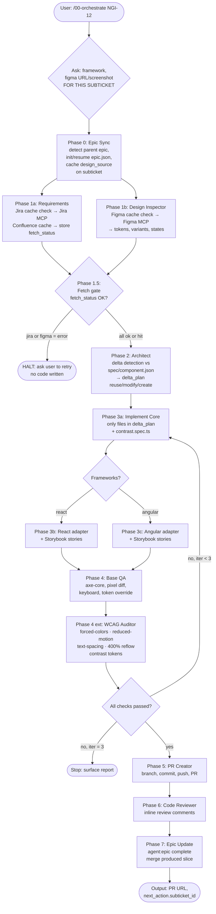
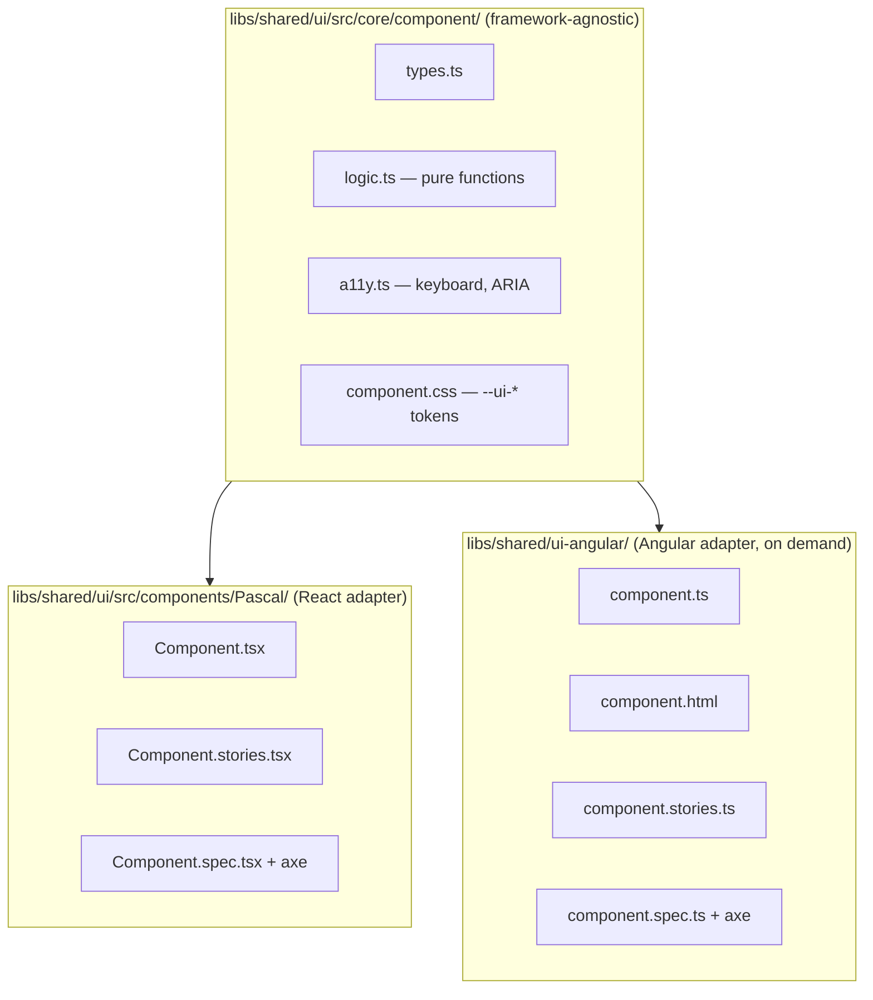

# Agent pipeline — full guide

> **Standup brief** — if you just want to know what this does and how to
> explain it in 2 minutes, jump to [the standup cheat-sheet](#standup-cheat-sheet).

A Jira → Figma → React/Angular component pipeline built on top of GitHub
Copilot Chat (Agent mode) and MCP servers. It supports two modes:

- **Single-ticket mode** — one Jira ticket with no parent epic. The
  pipeline runs end-to-end and writes a PR. No persistent memory.
- **Epic mode** — Jira ticket has a parent epic. The pipeline maintains
  durable per-epic memory under `.agent-run/epics/<EPIC_ID>/` so that
  sibling subtickets (worked on different days) share decisions, tokens,
  exports, design source, and ADRs.

Both modes are auto-detected from the Jira ticket — you don't pick.

---

## TL;DR — answers to the common questions

**Can I work on both epic-level and single tickets?**
Yes. Phase 0 of the orchestrator inspects the Jira ticket's `parent`.

- No parent epic → single-ticket mode (silent).
- Parent epic already marked ignored → single-ticket mode (silent).
- Parent epic already has memory (`epic.json`) → epic mode (silent;
  you opted in earlier).
- Parent epic is new → the orchestrator ASKS once whether to use shared
  memory for it.

**Do I have to use shared epic memory for every epic? My epic is
"performance improvements" — the subtickets are unrelated.**
No. Epic memory is **opt-in per epic**. When the orchestrator sees a
parent epic for the first time it asks:

> Ticket {SUB} is part of epic {EPIC} — "{title}". Use shared epic
> memory for this epic? Say YES only if the subtickets all build or
> extend the same component/feature. Say NO for grab-bag epics like
> performance/bugfix/infra sweeps. [y/N]

If you answer **no**, the orchestrator runs
`pnpm agent:epic ignore --epic {EPIC} --reason "..."`, which writes a
marker file. From then on every sibling subticket under that epic runs
in single-ticket mode silently — no prompts, no shared `must_respect`,
no cross-subticket constraints. You can reverse the decision any time
with `pnpm agent:epic unignore --epic {EPIC}`.

Rule of thumb:

- **YES (epic mode)** — "Build the data-table" with subtickets for
  table / pagination / sticky header. Shared exports, shared tokens.
- **NO (single-ticket)** — "Q3 performance sweep", "Backlog bugfixes",
  "Dependency upgrades". Unrelated tickets that happen to be siblings.

**When I work on an epic, do I have to re-attach Figma every subticket?**
Yes — and this is intentional. Each subticket usually shows a different
state of the same component (NGI-12 = plain table, NGI-13 = table with
pagination, NGI-14 = table with sticky header). The orchestrator stores
the design pointer on the **subticket** (`epic.json → subtickets[i].design_source`)
via `agent:epic set-design --subticket {id}`. When you `start` a
subticket, the seeded `context.json` includes:

- `design_source` — THIS subticket's figma URL / screenshot.
- `previous_designs[]` — figma URLs/screenshots for every already-`done`
  sibling subticket, so the architect can visually diff old vs new.

The architect (Phase 2) then performs **delta detection**: it reads
`spec/component.json` (exports/types already shipped) + `must_respect.existing_files`

- `previous_designs[]`, compares against the new design, and emits
  `architecture.delta_plan = { reuse_existing, modify, create, breaking_changes }`.
  Implementers (Phase 3) hard-refuse to touch any file outside `modify ∪ create`,
  so a "table + pagination" subticket only writes the Pagination
  sub-component and an additive prop on `DataTableProps` — it never
  rewrites the table.

**Where is state stored?**

```
.agent-run/                              ← git-ignored
├── {TICKET_ID}/                         ← single-ticket mode artifacts
│   ├── context.json
│   └── pipeline.log
└── epics/{EPIC_ID}/                     ← epic-mode memory (managed)
    ├── epic.json                        ← never hand-edit
    ├── IGNORED.json                     ← present iff this epic is opted-out
    ├── progress.md                      ← append-only journal
    ├── spec/
    │   ├── component.json               ← merged exports/types
    │   ├── tokens.css                   ← canonical --ui-* tokens
    │   └── decisions.md                 ← ADR log
    └── subtickets/{SUBTICKET_ID}/context.json
```

All epic writes go through `tools/scripts/epic-sync.mjs` (via
`pnpm agent:epic <cmd>`). The script does atomic writes, dedup, schema
validation, and recomputes `next_action` deterministically — LLMs never
edit `epic.json` directly.

---

## Standup cheat-sheet

> Paste this verbatim, or read it aloud — it covers the whole system in
> ~2 minutes.

**What we built:**
We have an AI-powered component pipeline that takes a Jira ticket number
as input and produces a merged, reviewed pull request with zero manual
boilerplate. A single `/00-orchestrate` command drives 9 sequential agent
phases, each scoped to one responsibility.

**The 9 phases at a glance:**

| #   | Phase                | What it does                                                                                                                                                                                                        |
| --- | -------------------- | ------------------------------------------------------------------------------------------------------------------------------------------------------------------------------------------------------------------- |
| 0   | **Epic Sync**        | Detects the parent epic, asks once whether to use shared cross-subticket memory, then seeds `context.json` with prior decisions/exports                                                                             |
| 1a  | **Requirements**     | Checks a 6-hour TTL cache first, then hits the Jira + Confluence MCPs; stores a `fetch_status` slice                                                                                                                |
| 1b  | **Design Inspector** | Same cache pattern for Figma; extracts real hex/px/typography tokens                                                                                                                                                |
| 1.5 | **Fetch gate**       | Hard stop if any MCP call returned an error — no code is written until data is confirmed                                                                                                                            |
| 2   | **Architect**        | Diffs the new design against what's already shipped (`spec/component.json`), emits a `delta_plan` of files to reuse / modify / create                                                                               |
| 3   | **Implement**        | Writes only the files in `delta_plan` — core types + CSS tokens first, then React and/or Angular adapters with Storybook stories                                                                                    |
| 4   | **QA**               | Runs axe-core, pixel diff, keyboard simulation, token override checks, **then** a deep WCAG auditor (forced-colors, reduced-motion, text-spacing, 400% reflow, contrast tokens). Loops up to 3 times if things fail |
| 5–6 | **PR + Review**      | Opens a branch, commits, pushes, creates the PR, and leaves inline review comments                                                                                                                                  |
| 7   | **Epic Update**      | Merges new exports/tokens/types back into shared epic memory so the next subticket inherits them                                                                                                                    |

**Key safeguards we added this sprint:**

1. **TTL cache** — Jira, Confluence, and Figma responses are cached for
   6 hours in `.agent-run/cache/`. Subsequent runs on the same ticket
   don't waste API calls or rate-limit tokens.
2. **Fetch gate** — Phase 1.5 reads `fetch_status` and aborts before any
   code generation if a source returned an error. Prevents "hallucinated
   fixes to missing requirements."
3. **Deep WCAG audit** — After the standard axe pass, a dedicated subagent
   (`07b-wcag-auditor`) runs five checks that axe-core alone cannot catch:
   Windows High Contrast (forced-colors), prefers-reduced-motion, WCAG
   1.4.12 text-spacing, 1.4.10 400% reflow, and contrast-token math via
   our own `contrast-check` utility.
4. **Storybook CI gate** — `.github/workflows/storybook-a11y.yml` blocks
   PRs that touch `libs/shared/ui/**` if any story fails axe wcag2aa
   rules.
5. **Contrast unit tests** — every core slice now ships a
   `<component>.contrast.spec.ts` that imports `auditPairs` from
   `tools/scripts/contrast-check.mjs` and fails the test run if any
   `--ui-*-fg` / `--ui-*-bg` token pair is below the AA threshold.

**Commands team members interact with day-to-day:**

```bash
# Start a pipeline run
#file:.github/prompts/00-orchestrate.prompt.md  → then type the ticket ID

# Cache management (rarely needed manually)
pnpm agent:cache list
pnpm agent:cache purge --key "jira:NGI-12"

# Contrast check on a pair
pnpm agent:contrast ratio --fg "#3b82f6" --bg "#1e3a5f" --kind normal_text

# Epic memory inspection
pnpm agent:epic status --epic NGI-11
pnpm agent:epic next   --epic NGI-11
```

---

## Architecture

### High-level pipeline (per subticket / single ticket)



### Epic memory across multiple subticket runs

```mermaid
flowchart LR
    subgraph Day1["Day 1 — NGI-12 (plain table)"]
        T12[NGI-12 pipeline run<br/>user provides<br/>figma URL: table.png]
        T12 --> EM1[(epic-sync<br/>set-design NGI-12<br/>+ complete NGI-12)]
    end

    subgraph Memory[".agent-run/epics/NGI-11/"]
        EJ[epic.json<br/>subtickets[].design_source<br/>per-subticket pointers]
        SC[spec/component.json<br/>shipped exports, types]
        TK[spec/tokens.css<br/>--ui-* tokens]
        DC[spec/decisions.md<br/>ADRs]
        PR[progress.md<br/>daily journal]
    end

    subgraph Day2["Day 2 — NGI-13 (table + pagination)"]
        Orc[/00-orchestrate NGI-13/]
        Orc --> Ask[Ask: figma URL<br/>FOR NGI-13<br/>table-paginated.png]
        Ask --> P0d2[Phase 0:<br/>set-design NGI-13,<br/>start NGI-13]
        P0d2 --> Ctx[context.json seeded with:<br/>design_source (NGI-13),<br/>previous_designs[NGI-12],<br/>must_respect]
        Ctx --> Arc[Architect Step 0:<br/>delta_plan = <br/>reuse DataTable.tsx,<br/>modify types.ts/css,<br/>create TablePagination.tsx]
        Arc --> Impl[Implementer:<br/>writes ONLY Pagination,<br/>NGI-12 files frozen]
    end

    EM1 --> EJ
    EM1 --> SC
    EM1 --> TK
    EM1 --> PR
    EJ -.read.-> P0d2
    SC -.read.-> Ctx
    TK -.read.-> Ctx
    PR -.last 50 lines.-> Ctx
```

### Three-layer cross-framework component model



---

## Deep dive: how delta detection works (Phase 2)

The architect never looks at a blank slate. Before planning a single file
it reads three sources of truth that Phase 0 already seeded into
`context.json`:

| Source                        | What it contains                                                             |
| ----------------------------- | ---------------------------------------------------------------------------- |
| `spec/component.json`         | Every export symbol, prop type, and public API shipped by earlier subtickets |
| `spec/tokens.css`             | The canonical `--ui-<component>-*` token definitions already on disk         |
| `must_respect.existing_files` | Absolute paths of every source file that belongs to this component           |

It also loads `previous_designs[]` — the Figma URLs/screenshots used by
every already-completed sibling subticket — so it can visually compare
the OLD design against the NEW one from the current ticket.

For each piece of UI visible in the new Figma design the architect
classifies it into one of three buckets:

```
reuse_existing  → design matches what's already shipped → list the file, do nothing
modify          → already exists but the design changes it → list file + 1-sentence diff
create          → net-new, no prior subticket shipped it → list path + purpose
```

Breaking-change detection is explicit: if a `modify` would rename or
remove an existing export or change a token value, the architect emits
`breaking_changes: [...]` and **halts for user confirmation** before
writing a single line of code.

If both `modify` and `create` are empty after classification, the
architect sets `delta_plan.no_op = true` and the orchestrator skips
Phase 3 entirely — the existing code already satisfies the new design.

Implementers in Phase 3 enforce this contract mechanically: they
hard-refuse to touch any path in `reuse_existing` and only write to
paths listed in `modify ∪ create`. This is what prevents a
"table + pagination" subticket from accidentally rewriting the base
table that was already reviewed and merged.

### What the delta_plan looks like in practice

```jsonc
// context.json → architecture.delta_plan
{
  "reuse_existing": [
    {
      "path": "libs/shared/ui/src/components/DataTable/DataTable.tsx",
      "reason": "Default table body matches NGI-12; unchanged in this design.",
    },
  ],
  "modify": [
    {
      "path": "libs/shared/ui/src/core/data-table/data-table.types.ts",
      "change": "Add optional `pagination?: PaginationConfig` to DataTableProps.",
    },
    {
      "path": "libs/shared/ui/src/core/data-table/data-table.css",
      "change": "Add --ui-data-table-pagination-* token group (6 new tokens).",
    },
  ],
  "create": [
    {
      "path": "libs/shared/ui/src/components/DataTable/TablePagination.tsx",
      "purpose": "Pagination sub-component (Prev / page numbers / Next).",
    },
    {
      "path": "libs/shared/ui/src/components/DataTable/TablePagination.stories.tsx",
      "purpose": "Stories: Default, FirstPage, LastPage, ManyPages.",
    },
    {
      "path": "libs/shared/ui/src/components/DataTable/TablePagination.spec.tsx",
      "purpose": "Unit + axe + keyboard tests.",
    },
    {
      "path": "libs/shared/ui/src/core/data-table/data-table.contrast.spec.ts",
      "purpose": "Deterministic WCAG AA contrast unit test for all token pairs.",
    },
  ],
  "breaking_changes": [],
  "no_op": false,
}
```

In single-ticket mode (no parent epic) delta detection is skipped — all
work goes into `create`.

---

## Deep dive: how the WCAG audit works (Phase 4)

Yes — it opens Storybook. The entire audit runs against a live browser
pointing at the Storybook preview URL. Here is exactly what happens:

### Step 1 — Base QA in the browser (Check 1–5 in 07-qa)

The QA agent uses the **chrome-devtools MCP** to connect to a running
Storybook instance (`pnpm nx storybook shared-ui` must be up). It
navigates to each variant story and:

- **Pixel diff** — reads `getComputedStyle` on every visual element and
  compares against `design.tokens.{colors,spacing,typography}`. Scores
  0–100; anything below 90 fails.
- **axe-core** — injects axe into the page and calls `axe.run()` filtered
  to wcag2a + wcag2aa + wcag21a + wcag21aa tags. Any violation is a
  blocker.
- **Semantic HTML** — reads the adapter source directly and checks that
  the root element matches the architect's `semantic_html.root` plan
  (e.g. `<table>`, not a `<div>`).
- **Keyboard simulation** — uses `page.keyboard.press('Tab')` to walk
  focus and assert logical order, visible focus ring, and
  Enter/Space/Escape activation.
- **Token override smoke test** — opens the `TailwindTheme` and
  `CssTheme` story variants and asserts computed colours actually changed
  vs `Default`.

### Step 2 — Deep WCAG audit subagent (Check 6 in 07-qa, all of 07b-wcag-auditor)

Once Checks 1–5 pass, the `07b-wcag-auditor` subagent is invoked **once
per adapter** (react, angular). It opens the same Storybook stories — one
at a time — and runs five checks that axe-core cannot catch:

#### Check 1 — Forced-colors (Windows High Contrast, WCAG 1.4.1 / 1.4.11)

```
chrome-devtools MCP: emulate.forcedColors = "active"
→ reload story
→ getComputedStyle on every interactive element
→ assert border-width > 0 OR outline-width > 0
   OR element.style.forcedColorAdjust === "auto"
→ screenshot saved to .agent-run/{ticket}/audit/{adapter}/forced-colors-{story}.png
→ reset: forcedColors = "none"
```

This catches components that use only `background-color` to show focus
state — backgrounds are replaced by system colors in High Contrast mode,
making those states invisible.

#### Check 2 — Reduced motion (WCAG 2.3.3)

```
chrome-devtools MCP: emulate.reducedMotion = "reduce"
→ reload story
→ trigger hover/focus on each animated element
→ assert transitionDuration ≤ 0.01s AND animationDuration ≤ 0.01s
```

Any transition not wrapped in `@media (prefers-reduced-motion: no-preference)`
will still play under `reduce` emulation and fail this check.

#### Check 3 — Text spacing (WCAG 1.4.12)

```
page.addStyleTag({ content: `
  * { line-height: 1.5 !important;
      letter-spacing: 0.12em !important;
      word-spacing: 0.16em !important; }
  p { margin-bottom: 2em !important; }
` })
→ assert no text container has overflow:hidden with scrollHeight > clientHeight
→ assert document.documentElement.scrollWidth ≤ clientWidth + 1
```

This catches containers with fixed `height` that clip text when the user
applies a custom stylesheet — a real failure mode for components with
hard-coded pixel heights on text areas.

#### Check 4 — 400% reflow (WCAG 1.4.10)

```
chrome-devtools MCP: emulate.viewport = { width: 320, height: 256 }
→ reload story
→ assert document.documentElement.scrollWidth ≤ 321
```

320×256 CSS-px represents a 1280-px screen zoomed to 400%. Data tables
are automatically detected (via `architecture.semantic_html.root === "table"`
or component name matching `/table/i`) and flagged as `exempt` per the
SC 1.4.10 exception rather than failed — they are allowed to scroll
horizontally as long as the wrapper has `overflow-x: auto`.

#### Check 5 — Contrast tokens (deterministic, no browser needed)

```
build pairs.json from design.tokens.colors:
  for each --ui-<comp>-<variant>-fg token → find matching -bg token
  tag kind: normal_text (≥4.5:1) | large_text/ui (≥3:1)

shell: echo '<pairs.json>' | node tools/scripts/contrast-check.mjs audit --pairs -
→ exit 0 = all pairs pass
→ exit 1 = parse results[].passes === false, record each failure
```

This is a pure math check using the WCAG relative-luminance formula.
It doesn't need the browser — it reads hex values straight from
`design.tokens` and computes ratios. The same math is also run at unit
test time via `<component>.contrast.spec.ts` before any browser opens.

### How failures flow back

```
07b-wcag-auditor writes:
  context.json → qa.wcag_audit.{adapter} = {
    checks: { forced_colors, reduced_motion, text_spacing, reflow_400, contrast_token },
    passed: true | false
  }

07-qa reads qa.wcag_audit.{adapter}.passed
  → if false: set qa.passed = false
              bucket failures into qa.feedback_for_core / react / angular

Orchestrator reads qa.passed
  → if false AND iteration < 3: re-run implement phases with feedback
  → if false AND iteration = 3: stop, surface full report
```

Screenshots from Check 1 (forced-colors) are the only persistent
artefact — they are uploaded as a GitHub Actions artifact by the CI
workflow so reviewers can visually confirm High Contrast appearance
without needing to run the test locally.

---

## Deep dive: `spec/component.json`, `must_respect`, and how screenshots are loaded

### What is `spec/component.json`?

It is the **accumulated public API** of the component, written by
`epic-sync` after every subticket completes. It lives at:

```
.agent-run/epics/{EPIC_ID}/spec/component.json
```

`epic-sync init` seeds it with an empty shell:

```jsonc
{
  "schema_version": 1,
  "component": "data-table",
  "exports": [], // ← symbol names: ["DataTable", "DataTableProps", ...]
  "types": [], // ← TS interface names: ["PaginationConfig", ...]
  "notes": [], // ← free-form notes per completed subticket
}
```

When `pnpm agent:epic complete` runs at the end of Phase 7, the agent
pipes a `produced` JSON payload to it. `epic-sync` **merges** (deduplicates)
the new symbols into the lists and writes the file atomically:

```jsonc
// produced payload from Phase 7 (agent builds this from context.json)
{
  "files": ["libs/shared/ui/src/components/DataTable/DataTable.tsx", ...],
  "exports": ["DataTable", "DataTableProps"],
  "tokens_added": ["--ui-data-table-bg", "--ui-data-table-border-color"],
  "types": ["DataTableColumn", "DataTableSortDirection"],
  "notes": ["QA pixel score react=94/100", "WCAG criteria covered: 12"]
}
```

After NGI-12 completes, `spec/component.json` might look like:

```jsonc
{
  "schema_version": 1,
  "component": "data-table",
  "exports": ["DataTable", "DataTableProps"],
  "types": ["DataTableColumn", "DataTableSortDirection"],
  "notes": [{ "subticket": "NGI-12", "at": "2026-05-26T...", "notes": ["QA pixel score react=94/100"] }],
}
```

When NGI-13 runs, the Architect reads this file in Step 0. It knows
`DataTable` and `DataTableProps` already exist and must not be
redefined — they go into `reuse_existing`.

### What is `must_respect`?

`must_respect` is computed by `epic-sync` **deterministically** (pure
code, no LLM) every time `next` or `start` is called. It aggregates
everything produced by all `done` subtickets:

```js
// from epic-sync.mjs (actual source)
for (const sub of epic.subtickets) {
  if (sub.status !== 'done' || !sub.produced) continue;
  sub.produced.exports.forEach((e) => exports.add(e));
  sub.produced.tokens_added.forEach((t) => tokens.add(t));
  sub.produced.files.forEach((f) => files.add(f));
}
must_respect = {
  existing_exports: [...exports].sort(), // symbol names the implementer must not rename/delete
  existing_tokens: [...tokens].sort(), // CSS custom properties that must keep their names/values
  existing_files: [...files].sort(), // absolute paths the implementer must not overwrite
};
```

This object is injected into `context.json` at `start` time and is
read by the Architect and all three implementers (core, React, Angular)
as a hard constraint. No file in `existing_files` may be written;
no symbol in `existing_exports` may be removed or renamed — only new
names can be added.

### Does the agent decide on its own, or will it prompt me?

**It depends on the situation.** There are three cases:

| Situation                                                                                    | Agent behaviour                                                 |
| -------------------------------------------------------------------------------------------- | --------------------------------------------------------------- |
| `reuse_existing` — new design clearly matches what's shipped                                 | Agent decides silently, lists the files as frozen, and moves on |
| `modify` — additive change (new optional prop, new token group, layout tweak)                | Agent decides silently, lists what will change, and proceeds    |
| `breaking_change` — would rename/remove an existing export or change an existing token value | **Agent halts and asks you** before writing a single line       |

A breaking change is anything that would force consumers to update their
import statements, prop names, or CSS overrides. The Architect emits:

```jsonc
"breaking_changes": [
  {
    "type": "rename_export",
    "from": "DataTableProps",
    "to": "DataTableConfig",
    "reason": "Figma renames the type in the new design"
  }
]
```

…and stops. You either confirm ("yes, rename it — I'll update all
call-sites") or reject ("no, keep the old name and extend instead"). Only
after your answer does Phase 3 proceed.

For non-breaking classify/reuse decisions the agent does **not** ask —
it is fully deterministic from the data in `spec/component.json` and
the Figma design. You see the full `delta_plan` printed at the end of
Phase 2 before any file is written, so you can inspect it before the
implementers run.

### How does the agent load screenshots?

Figma pointers are stored on each **subticket** inside `epic.json` by
`agent:epic set-design` (Phase 0 step 6). Each pointer can be a Figma
URL, a Figma node ID, or a local screenshot path — or all three. When
`agent:epic start` is called for the current subticket, `epic-sync`
collects the design pointers from every **already-done** sibling and
injects them as `previous_designs[]` in the seeded `context.json`:

```js
// from epic-sync.mjs cmdStart() — actual source
previous_designs: epic.subtickets
  .filter((s) => s.status === 'done' && s.design_source)
  .map((s) => ({
    subticket_id: s.id,
    title: s.title,
    figma_url: s.design_source.figma_url, // may be null
    figma_node_id: s.design_source.figma_node_id, // may be null
    screenshot_path: s.design_source.screenshot_path, // may be null
  }));
```

The Architect (Phase 2) then loads each of these in Step 0:

- **Figma URL / node ID** → fetches the frame via the Figma MCP (same
  as Phase 1b), but read-only; it does not re-extract tokens, it just
  looks at the visual layout to understand what the old design shows.
- **Local screenshot path** (`screenshot_path`) → reads the PNG from
  disk using `codebase` tool access; no network call. This is the
  fallback when you gave a screenshot instead of a Figma URL when the
  orchestrator asked.

The Architect uses `previous_designs[]` purely for visual context —
"what did NGI-12 look like?" — so it can reason about _what changed_
in the new design. It does not re-run token extraction on old designs;
it only reads the already-extracted tokens from `spec/component.json`
and `spec/tokens.css`.

---

1. Environment variables (use `.env.local`; never commit):

   ```bash
   JIRA_BASE_URL=https://aristeksystems-team-f2twyvsi.atlassian.net
   JIRA_EMAIL=you@yourorg.com
   JIRA_API_TOKEN=your_atlassian_api_token
   CONFLUENCE_BASE_URL=https://aristeksystems-team-f2twyvsi.atlassian.net/wiki
   FIGMA_ACCESS_TOKEN=your_figma_token
   GITHUB_TOKEN=your_github_pat
   PR_REVIEWER=github_username   # optional
   ```

2. Fill in real values in [.agent-config.yml](.agent-config.yml).

3. Verify MCP servers in [.vscode/mcp.json](.vscode/mcp.json) are reachable.
   First run installs them via `npx`. In VS Code → Copilot Chat → tools
   icon, confirm `jira`, `confluence`, `figma`, `github`,
   `chrome-devtools` are present.

4. Storybook running before Phases 3/4:

   ```bash
   pnpm nx storybook shared-ui
   # and (if Angular adapter was built):
   pnpm nx storybook shared-ui-angular
   ```

---

## Running the pipeline

### Full pipeline (orchestrator)

1. Copilot Chat → Agent mode → select **Claude Opus 4.6** (model named in
   [.github/prompts/00-orchestrate.prompt.md](.github/prompts/00-orchestrate.prompt.md)).
2. Type:
   ```
   /00-orchestrate
   ```
   or
   ```
   #file:.github/prompts/00-orchestrate.prompt.md
   ```
   Then provide the ticket ID (e.g. `NGI-12`).

The orchestrator will ask:

| Question                | When asked                                                                                                                                                                     |
| ----------------------- | ------------------------------------------------------------------------------------------------------------------------------------------------------------------------------ |
| Ticket ID               | Always, unless you provided it in the prompt.                                                                                                                                  |
| Frameworks              | Always (React, Angular, or both).                                                                                                                                              |
| Figma URL / screenshot  | Always, **per subticket** \u2014 each one has its own design state.                                                                                                            |
| Use shared epic memory? | Only on the FIRST subticket of a brand-new parent epic. Answer is persisted (`epic.json` for yes, `IGNORED.json` for no). Subsequent siblings run silently in the chosen mode. |

### Single phase (debugging)

```
/01-requirements
/03-architect
/07-qa
```

Each phase reads/writes its slice of `context.json` and can be re-run
idempotently. Use the model named in that phase's frontmatter.

### Inspecting epic state

```bash
pnpm agent:epic list                              # all epics + progress
pnpm agent:epic status     --epic NGI-11          # full epic.json
pnpm agent:epic next       --epic NGI-11          # next subticket + must_respect
pnpm agent:epic get-design --epic NGI-11          # cached figma source
```

### Manual recovery (rare)

```bash
# stuck subticket: append a journal note and resume tomorrow
pnpm agent:epic journal --epic NGI-11 \
  --message "blocked on figma access; resume Tue"
```

There is deliberately no "reopen completed subticket" command — if you
need to revert, revert the PR and remove that subticket's entry from
`epic.json` by hand (no other process writes concurrently).

---

## Worked example — epic NGI-11 across three days

### Day 1 — NGI-12 (first subticket of the epic)

```
You: /00-orchestrate
Bot: Ticket ID?
You: NGI-12
Bot: Frameworks? [react | angular | both]
You: react
Bot: Figma URL for THIS subticket (NGI-12)?
You: https://figma.com/file/ABC/Data-Table?node-id=12-34
Bot: Screenshot path? (optional)
You: -
```

Phase 0 runs:

1. Detects parent NGI-11.
2. `agent:epic status --epic NGI-11` → not found.
3. Fetches NGI-12, NGI-13, NGI-14 from Jira → `agent:epic init`.
4. `agent:epic next --epic NGI-11` → NGI-12 (no deps).
5. `agent:epic start --epic NGI-11 --subticket NGI-12`.
6. `agent:epic set-design --epic NGI-11 --subticket NGI-12 --figma-url ...`.

Phases 1–6 produce a PR. Phase 7 runs `agent:epic complete --epic NGI-11
--subticket NGI-12 --pr-url ... --produced -`, which merges the new
exports/tokens/files into `spec/component.json` and `spec/tokens.css`.

### Day 2 — NGI-13 (depends on NGI-12)

```
You: /00-orchestrate
Bot: Ticket ID?
You: NGI-13
Bot: Frameworks?
You: react
Bot: Figma URL for THIS subticket (NGI-13)?
You: https://figma.com/file/ABC/Data-Table?node-id=56-78  (table + pagination)
```

Phase 0:

1. Detects parent NGI-11.
2. `agent:epic status --epic NGI-11` → exists.
3. `agent:epic next --epic NGI-11` → NGI-13 (deps on NGI-12 satisfied).
4. `agent:epic set-design --epic NGI-11 --subticket NGI-13 --figma-url ...`.
5. `agent:epic start --epic NGI-11 --subticket NGI-13` — context seed
   includes `must_respect.{existing_exports,existing_tokens,existing_files}`,
   THIS subticket's `design_source`, AND `previous_designs[]` listing
   NGI-12's figma pointer.

The **architect** now runs Step 0 (delta detection): it sees `DataTable`
already in `spec/component.json` and `DataTable.tsx` in
`must_respect.existing_files`. It compares the new design (table + footer
pagination) against NGI-12's design and emits:

```jsonc
delta_plan: {
  reuse_existing: ["libs/shared/ui/src/components/DataTable/DataTable.tsx"],
  modify: [
    { path: "libs/shared/ui/src/core/data-table/data-table.types.ts",
      change: "Add optional pagination?: PaginationConfig prop." },
    { path: "libs/shared/ui/src/core/data-table/data-table.css",
      change: "Add --ui-data-table-pagination-* token group." },
  ],
  create: [
    { path: "libs/shared/ui/src/components/DataTable/TablePagination.tsx" },
    { path: "libs/shared/ui/src/components/DataTable/TablePagination.stories.tsx" },
    { path: "libs/shared/ui/src/components/DataTable/TablePagination.spec.tsx" },
  ],
  breaking_changes: []
}
```

The **implementers** hard-refuse to touch `DataTable.tsx` (it's in
`reuse_existing`) and only write the Pagination files + the additive
edits. Result: NGI-13 ships pagination without re-implementing the table.

### Day 3 — NGI-14 (depends on NGI-12, NGI-13)

Same flow. `next_action` resolves to NGI-14 because both dependencies
are done.

### If you try to skip ahead

```bash
pnpm agent:epic start --epic NGI-11 --subticket NGI-14
# epic-sync: cannot start NGI-14: unmet dependencies NGI-13
# exit code 1
```

The orchestrator detects this and asks before proceeding.

---

## Working on a single ticket (no epic)

Just run `/00-orchestrate` with a ticket that has no parent. Phase 0
prints "no parent epic → skipping epic memory" and the pipeline runs
straight through. State lives at `.agent-run/{ticket_id}/context.json`
only.

---

## File map

| Path                                                                                                               | Purpose                                                                                |
| ------------------------------------------------------------------------------------------------------------------ | -------------------------------------------------------------------------------------- |
| [.github/prompts/00-orchestrate.prompt.md](.github/prompts/00-orchestrate.prompt.md)                               | Top-level orchestrator (Phase 0 + pipeline driver)                                     |
| [.github/prompts/01-requirements.prompt.md](.github/prompts/01-requirements.prompt.md)                             | Jira + Confluence extraction with TTL cache                                            |
| [.github/prompts/02-design-inspector.prompt.md](.github/prompts/02-design-inspector.prompt.md)                     | Figma tokens, variants, states with TTL cache                                          |
| [.github/prompts/03-architect.prompt.md](.github/prompts/03-architect.prompt.md)                                   | Delta detection, file plan, WCAG requirements                                          |
| [.github/prompts/04-implement-core.prompt.md](.github/prompts/04-implement-core.prompt.md)                         | Framework-agnostic core + contrast.spec.ts                                             |
| [.github/prompts/05-implement-react.prompt.md](.github/prompts/05-implement-react.prompt.md)                       | React adapter + Storybook                                                              |
| [.github/prompts/06-implement-angular.prompt.md](.github/prompts/06-implement-angular.prompt.md)                   | Angular adapter (on demand)                                                            |
| [.github/prompts/07-qa.prompt.md](.github/prompts/07-qa.prompt.md)                                                 | axe, pixel diff, keyboard, override + invokes auditor                                  |
| [.github/prompts/07b-wcag-auditor.prompt.md](.github/prompts/07b-wcag-auditor.prompt.md)                           | Deep WCAG subagent (5 checks via chrome-devtools MCP)                                  |
| [.github/prompts/08-pr-creator.prompt.md](.github/prompts/08-pr-creator.prompt.md)                                 | Branch, commit, push, PR + `agent:epic complete`                                       |
| [.github/prompts/09-code-reviewer.prompt.md](.github/prompts/09-code-reviewer.prompt.md)                           | Inline PR review                                                                       |
| [.github/instructions/cross-framework-ui.instructions.md](.github/instructions/cross-framework-ui.instructions.md) | Three-layer component contract                                                         |
| [.github/instructions/wcag-aa.instructions.md](.github/instructions/wcag-aa.instructions.md)                       | WCAG 2.1 AA rules including §13–§17 (forced-colors, motion, spacing, reflow, contrast) |
| [.github/instructions/table-library.instructions.md](.github/instructions/table-library.instructions.md)           | Table-specific rules                                                                   |
| [.github/workflows/storybook-a11y.yml](.github/workflows/storybook-a11y.yml)                                       | CI gate: axe wcag2aa on every PR touching shared-ui                                    |
| [tools/scripts/epic-sync.mjs](tools/scripts/epic-sync.mjs)                                                         | Epic memory CLI                                                                        |
| [tools/scripts/fetch-cache.mjs](tools/scripts/fetch-cache.mjs)                                                     | TTL cache CLI for Jira/Confluence/Figma payloads                                       |
| [tools/scripts/contrast-check.mjs](tools/scripts/contrast-check.mjs)                                               | WCAG contrast-ratio math; importable + CLI                                             |
| [tools/scripts/epic.schema.json](tools/scripts/epic.schema.json)                                                   | `epic.json` JSON Schema                                                                |
| [tools/scripts/README.md](tools/scripts/README.md)                                                                 | Epic-sync usage                                                                        |
| [libs/shared/ui/.storybook/test-runner.js](libs/shared/ui/.storybook/test-runner.js)                               | axe-playwright config for `pnpm nx test-storybook`                                     |

---

## `epic-sync` command reference

| Command        | Purpose                                                                                                                                                                                                             |
| -------------- | ------------------------------------------------------------------------------------------------------------------------------------------------------------------------------------------------------------------- |
| `init`         | Seed a new epic. `--epic --title --component [--subtickets json\|-]`                                                                                                                                                |
| `status`       | Print the full `epic.json`.                                                                                                                                                                                         |
| `next`         | Print `next_action` (which subticket to pick up and what to respect).                                                                                                                                               |
| `start`        | Mark a subticket `in_progress`; emit context seed with `must_respect`, this subticket's `design_source`, and `previous_designs[]`.                                                                                  |
| `complete`     | Mark a subticket `done`, merge `produced` slice, update PR URL, append journal.                                                                                                                                     |
| `journal`      | Append a free-form line to `progress.md`.                                                                                                                                                                           |
| `add-decision` | Append an ADR entry.                                                                                                                                                                                                |
| `add-tokens`   | Append tokens to `spec/tokens.css` outside the normal `complete` flow.                                                                                                                                              |
| `set-design`   | Cache design source on a **subticket**. `--epic --subticket` required; `--figma-url --figma-file-key --figma-node-id --screenshot --notes` (figma-url or screenshot required).                                      |
| `get-design`   | Print a subticket's `design_source` (null if none). `--epic --subticket` required.                                                                                                                                  |
| `ignore`       | Mark an epic as "no shared memory". `--epic --reason "..."`. Refuses if `epic.json` already exists (delete the folder by hand first). Future runs against any sibling subticket run in single-ticket mode silently. |
| `unignore`     | Remove the ignore marker. `--epic`. Next sibling run will re-ask the opt-in question.                                                                                                                               |
| `list`         | Print all epics with status + done/total.                                                                                                                                                                           |

Every command returns `{ "ok": true, ... }` on success and exits non-zero
with `{ "ok": false, "error": "..." }` on failure.

---

## `fetch-cache` command reference

Manages the 6-hour TTL cache for Jira / Confluence / Figma payloads.
Storage: `.agent-run/cache/<sha1(key)>.json`. All reads/writes are atomic.

```bash
pnpm agent:cache get     --key "jira:NGI-12" [--ttl-seconds 21600]
pnpm agent:cache set     --key "jira:NGI-12" --source jira [--ttl-seconds 21600] < payload.json
pnpm agent:cache peek    --key "jira:NGI-12"   # metadata only, no payload
pnpm agent:cache purge   --key "jira:NGI-12"
pnpm agent:cache purge-all [--older-than 86400] # remove entries older than N seconds
pnpm agent:cache list                           # all cache entries + status
```

`get` returns `status: "hit" | "stale" | "miss"`. On `stale` the payload
is null — the caller must re-fetch and `set` a fresh value. `--ttl-seconds 0`
always returns `stale` regardless of age (useful to force-refresh).

---

## `contrast-check` command reference

WCAG contrast-ratio math. Also importable as an ES module in unit tests.

```bash
# Single pair
pnpm agent:contrast ratio --fg "#3b82f6" --bg "#1e3a5f" --kind normal_text
# normal_text requires ≥ 4.5:1; large_text and ui require ≥ 3:1

# Batch audit from a JSON array [{ name, fg, bg, kind }]
echo '[{"name":"btn","fg":"#fff","bg":"#0050b3","kind":"normal_text"}]' \
  | pnpm agent:contrast audit --pairs -

# From a file
pnpm agent:contrast audit --pairs pairs.json
```

Exit 0 = all pairs pass. Exit 1 = at least one fails. Exit 2 = usage error.

Importable in tests:

```ts
import { auditPairs, contrastRatio, AA_NORMAL } from '../../../../../tools/scripts/contrast-check.mjs';
```

---

## Troubleshooting

| Symptom                                            | Fix                                                                                                                                                                                                      |
| -------------------------------------------------- | -------------------------------------------------------------------------------------------------------------------------------------------------------------------------------------------------------- |
| MCP server not appearing                           | Restart VS Code; verify `.vscode/mcp.json` syntax.                                                                                                                                                       |
| Jira auth fails                                    | Use an Atlassian API token, not your password.                                                                                                                                                           |
| Figma component not found                          | Check `FIGMA_FILE_KEY` matches the ID in the Figma URL.                                                                                                                                                  |
| Orchestrator re-asks Figma every subticket         | This is intentional — each subticket has its own design state. If you really want to reuse the prior URL, paste it again.                                                                                |
| Orchestrator keeps asking "use epic memory?"       | Either answer once (the choice is persisted), or pre-seed it manually: `pnpm agent:epic ignore --epic <id> --reason "grab-bag"` for no, or run the orchestrator once and answer yes for epic mode.       |
| Orchestrator stopped asking and you wanted memory  | `pnpm agent:epic unignore --epic <id>` — next subticket run re-asks.                                                                                                                                     |
| DevTools timeout in Phase 4                        | Ensure Storybook is running before Phase 3/4.                                                                                                                                                            |
| Angular plugin missing                             | The Architect plans `pnpm nx add @nx/angular`; let it run.                                                                                                                                               |
| QA loops 3 times and fails                         | Inspect `qa.feedback_for_*` in the subticket `context.json`.                                                                                                                                             |
| `epic-sync: cannot start <ID>: unmet dependencies` | A prior subticket isn't `done`. Run `pnpm agent:epic next --epic <id>` to see what's actually next.                                                                                                      |
| Need to bump the epic schema                       | Change `SCHEMA_VERSION` in both [tools/scripts/epic-sync.mjs](tools/scripts/epic-sync.mjs) and [tools/scripts/epic.schema.json](tools/scripts/epic.schema.json); add a migration branch in `loadEpic()`. |
